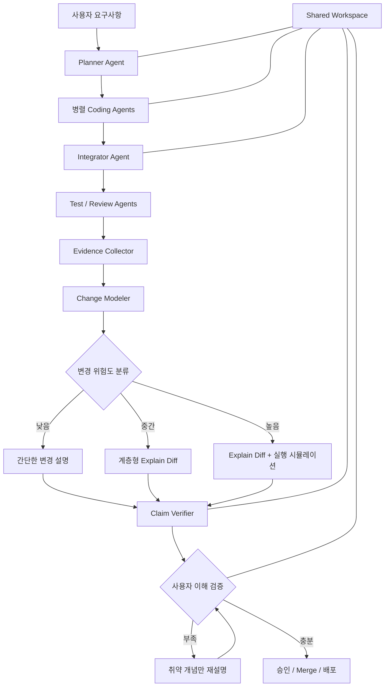

# 멀티에이전트 코딩 툴의 Cognitive Sync Layer 설계안

## 1. 결론

이 기능은 넣는 것이 좋다. 단순한 코드 설명 부가기능이 아니라, 멀티에이전트 코딩 툴의 핵심 차별점으로 발전시킬 수 있다.

멀티에이전트 코딩 툴은 일반 코딩 에이전트보다 인지 부채(Cognitive Debt)가 훨씬 빠르게 쌓인다.

- Planner가 설계하고
- 여러 Coding Agent가 병렬로 수정하고
- Reviewer가 검증하고
- Integrator가 합치고
- Test Agent가 통과시키는 구조에서는

코드는 정상 동작하더라도 사용자가 **누가 왜 어떤 판단을 했고 전체 시스템이 어떻게 변했는지 모르는 상태**가 되기 쉽다.

따라서 이 기능은 단순한 `Explain this code`가 아니라, 다음과 같은 제품 철학으로 잡는 것이 좋다.

> 코드를 대신 작성하는 도구가 아니라, 사용자가 자신이 만든 시스템을 계속 소유할 수 있게 해주는 코딩 도구

발표에서 다룬 Explanation, Quiz, Microworld, Shared Space를 각각 따로 붙이기보다는 하나의 **Cognitive Sync Layer**, 즉 **인지 동기화 계층**으로 묶는 것이 핵심이다.

---

## 2. 이 기능이 해결하는 진짜 문제

기존 코딩 에이전트는 주로 다음 질문에 집중한다.

> 이 코드가 맞는가?

하지만 사용자가 장기적으로 필요한 질문은 다음이다.

> 나는 이 시스템을 이해하고 있으며, 다음 설계 결정을 직접 내릴 수 있는가?

코드가 테스트를 통과하는 것과 사용자가 코드를 소유하는 것은 전혀 다른 문제다.

특히 멀티에이전트에서는 다음과 같은 문제가 발생한다.

| 문제 | 발생 원인 |
|---|---|
| 결정 근거 유실 | Planner와 Coder의 판단이 여러 메시지에 흩어짐 |
| 시스템 구조 상실 | 여러 에이전트가 서로 다른 파일을 병렬 수정 |
| 사후 합리화 | 구현 후 LLM이 실제 이유가 아닌 그럴듯한 이유를 생성 |
| 검증 착각 | 테스트 통과를 설계 이해와 동일시 |
| 변경 누적 | 사용자가 이전 변경을 이해하기 전에 다음 작업 시작 |
| 설명 노후화 | 설명 생성 후 코드가 다시 바뀌었는데 문서는 유지됨 |

따라서 단순한 `Explain this code` 버튼으로는 부족하다.

**요구사항 → 설계 결정 → 에이전트 실행 → 코드 변경 → 테스트 → 설명 → 이해 검증**

이 전체 흐름이 하나로 연결되어야 한다.

---

## 3. 추천 전체 구조



이 구조는 분기와 재설명 순환이 있으므로, 단일 체인보다 **LangGraph 형태가 더 적합하다.**

---

## 4. 변경마다 생성할 Understanding Bundle

에이전트 작업이 끝날 때 단순히 diff만 보여주는 것이 아니라, 변경 단위마다 하나의 `Understanding Bundle`을 생성하는 방식이 좋다.

| 구성 요소 | 내용 |
|---|---|
| 30초 요약 | 무엇을, 왜 변경했는지 |
| 변경 전 구조 | 기존 요청·데이터·상태 흐름 |
| 변경 후 구조 | 변경으로 무엇이 달라졌는지 |
| 핵심 개념 | 사용자가 반드시 이해해야 하는 개념 |
| Literate Diff | 파일 순서가 아니라 이해하기 좋은 순서로 설명 |
| 결정 근거 | 실제 작업 중 기록된 설계 결정 |
| 불변조건 | 어떤 상황에서도 깨지면 안 되는 조건 |
| 위험과 한계 | 실패 가능성, 미검증 영역 |
| 테스트 근거 | 어떤 테스트가 무엇을 증명하는지 |
| 이해도 문제 | 단순 암기가 아닌 구조 이해 문제 |
| 실행 탐색기 | 필요한 경우 상태·데이터 흐름 시뮬레이션 |
| 토론 공간 | 사람과 에이전트가 같은 문서를 놓고 논의 |

가장 중요한 원칙은 모든 설명을 **실제 코드와 증거에 연결하는 것**이다.

---

## 5. Explain Diff는 일반 AI 요약과 달라야 한다

### 나쁜 방식

```text
이번 변경에서는 사용자 인증 로직을 개선했습니다.
보안성과 유지보수성을 높였습니다.
```

이런 설명은 구체적이지 않고 사실 여부도 검증하기 어렵다.

### 좋은 방식

```text
1. POST /auth/refresh 요청은 이제 refresh_token을 직접 재사용하지 않습니다.

2. auth/service.py의 rotate_refresh_token()이
   기존 토큰을 폐기하고 새로운 토큰을 발급합니다.

3. 동일한 refresh_token이 두 번 사용되면
   token_family 전체가 폐기됩니다.

4. 이 동작은 test_refresh_reuse_revokes_family 테스트에서 검증됩니다.

5. 아직 검증하지 못한 부분:
   Redis 장애가 발생한 순간의 동시 요청 처리.
```

각 문장은 다음 중 하나로 분류하는 것이 좋다.

| 유형 | 의미 |
|---|---|
| `FACT` | 코드나 실행 결과에서 직접 확인된 사실 |
| `RECORDED_DECISION` | Planner나 사용자가 실제로 기록한 결정 |
| `INFERENCE` | 코드로부터 추론했지만 명시적으로 기록되지는 않은 내용 |
| `OPEN_QUESTION` | 아직 검증되지 않았거나 결정되지 않은 부분 |

이 구분이 중요한 이유는 LLM이 구현이 끝난 후 **실제로 하지 않았던 고민을 사후에 지어낼 수 있기 때문**이다.

따라서 "왜 이렇게 설계했는가"는 구현 후 추론만 하지 말고, 작업 중 다음처럼 기록하는 것이 좋다.

```json
{
  "decision": "에이전트 재시도 상태를 Redis에 저장한다",
  "reason": "서버 재시작 후에도 작업을 이어가기 위해서다",
  "alternatives": [
    "프로세스 메모리",
    "PostgreSQL"
  ],
  "rejected_reasons": {
    "프로세스 메모리": "재시작 시 상태가 사라진다",
    "PostgreSQL": "짧은 수명의 상태 업데이트에 비용이 크다"
  }
}
```

숨겨진 Chain of Thought를 저장할 필요는 없다.

대신 다음 정보만 저장하면 된다.

- 명시적인 결정
- 가정
- 대안
- 대안을 버린 이유
- 실행 결과

---

## 6. 설명 Agent와 구현 Agent를 분리해야 한다

구현한 Agent가 자신의 코드를 설명하고 검증까지 전부 담당하면 다음 문제가 생길 수 있다.

> 자신이 잘못 이해한 설계를 똑같이 잘못 설명할 수 있다.

추천 구성은 다음과 같다.

| Agent | 역할 |
|---|---|
| Coding Agent | 코드 작성 |
| Evidence Collector | diff, AST, 테스트, 로그, 실행 추적 수집 |
| Forensic Explainer | 구현자의 설명을 믿지 않고 결과물에서 구조를 재구성 |
| Claim Verifier | 설명의 각 문장이 실제 증거와 일치하는지 검증 |
| Quiz Agent | 핵심 개념과 오개념을 기반으로 문제 생성 |
| Quiz Evaluator | 사용자의 답변을 근거 기반 루브릭으로 평가 |
| Microworld Agent | 필요한 변경에만 탐색형 UI 생성 |
| Integrator | 여러 Agent의 결과를 하나의 설명으로 통합 |

특히 `Claim Verifier`는 다음을 대조해야 한다.

1. 원래 요구사항
2. Planner의 계획
3. 실제 최종 diff
4. 테스트 결과
5. 실행 로그와 trace
6. 설명문

계획과 실제 구현이 다르면 다음처럼 표시할 수 있다.

```text
계획에서는 PostgreSQL 저장을 사용하기로 했지만,
최종 구현은 Redis를 사용하고 있습니다.

변경 이유는 작업 기록에서 발견되지 않았습니다.
현재 상태: 설명 필요
```

이 기능은 일반적인 코드 설명보다 훨씬 가치가 크다.

---

## 7. Quiz는 읽었는지가 아니라 참여할 수 있는지를 검사해야 한다

퀴즈 자체는 좋은 아이디어지만, 단순 암기 문제로 만들면 금방 귀찮은 기능이 된다.

### 피해야 하는 문제

```text
이번에 변경된 파일 이름은 무엇입니까?
```

이는 파일명을 기억했는지만 검사한다.

### 좋은 문제 유형

#### 흐름 추적

```text
Reviewer Agent가 실패를 반환하면,
다음으로 실행되는 노드와 변경되는 state 필드는 무엇입니까?
```

#### 반사실 문제

```text
idempotency_key 검사를 제거하면,
재시도 상황에서 어떤 중복 실행이 발생할 수 있습니까?
```

#### 불변조건 문제

```text
병렬 Coding Agent가 동시에 작업하더라도
반드시 유지되어야 하는 상태 조건은 무엇입니까?
```

#### 근거 문제

```text
에이전트 작업이 중복 실행되지 않는다는 것을
어떤 테스트가 증명합니까?
```

#### 설계 판단 문제

```text
현재 상태 저장 방식을 메모리 기반으로 바꾸면
서버 재시작 시 어떤 문제가 발생합니까?
```

---

## 8. 위험도에 따라 퀴즈 강도를 달리해야 한다

| 변경 유형 | 이해 검증 |
|---|---|
| 문구·스타일 변경 | 설명만 제공 |
| 단순 CRUD | 1~2문항 |
| API·DB 스키마 변경 | 3~4문항 |
| 인증·결제·권한 | 핵심 문제 통과 필요 |
| 동시성·분산 처리 | 실행 추적과 시나리오 문제 |
| 대규모 아키텍처 변경 | 설명, 시뮬레이션, 사람 승인 |

모든 변경에 동일한 수의 문제를 강제하면 사용자는 기능을 꺼버릴 가능성이 높다.

따라서 퀴즈는 **일률적인 진입 장벽이 아니라 위험도 기반 속도 조절기**여야 한다.

또한 이해도를 하나의 숫자로만 표현하는 것보다 다음처럼 보여주는 것이 좋다.

```text
핵심 개념 6개 중 4개 검증됨

검증됨
- 요청 실행 경로
- Agent 재시도 조건
- 상태 저장 위치
- 테스트 범위

아직 검증되지 않음
- 중복 실행 방지 원리
- 실패 후 rollback 경로
```

---

## 9. Microworld는 매우 좋지만 아무 코드에나 만들면 안 된다

Microworld는 이 기능 중 가장 인상적이지만 동시에 가장 비싸고 위험하다.

다음 유형에는 효과가 크다.

- 상태 머신
- LangGraph 분기와 순환
- 비동기 작업
- 동시성·락·경쟁 상태
- 캐시와 KV Cache
- 데이터 파이프라인
- 파일 마이그레이션
- Parser·Interpreter
- 그래픽 좌표 변환
- 권한 전파
- 재시도·보상 트랜잭션

반대로 다음에는 과한 기능이다.

- 단순 DTO 추가
- CSS 변경
- 간단한 API 라우트
- 단순 문구 수정

---

## 10. 가장 먼저 만들 Microworld: Multi-Agent Execution Replay

임의의 HTML 시뮬레이터를 먼저 생성하는 것보다, **멀티에이전트 실행 Replay UI**부터 만드는 것이 좋다.

예시:

```text
시간축
00:00 Planner 시작
00:04 계획 생성
00:08 Backend Agent 작업 시작
00:09 Frontend Agent 작업 시작
00:16 Backend Agent 테스트 실패
00:18 Reviewer가 재작업 요청
00:23 Backend Agent 수정
00:28 Integrator 병합
00:31 전체 테스트 통과
```

사용자가 타임라인을 움직이면 다음을 볼 수 있게 한다.

- 현재 실행 중인 Agent
- Agent가 받은 입력
- 해당 단계에서 변경된 Graph State
- 호출한 Tool
- 수정한 파일과 심볼
- 테스트 결과
- 이전 상태와 이후 상태의 차이
- 다음 노드를 선택한 이유
- 병렬 Agent 간 충돌
- 해당 시점의 비용과 토큰 사용량

예를 들어:

```text
Node: reviewer

입력 상태
review_status = "pending"
retry_count = 1

출력 상태
review_status = "changes_requested"
retry_count = 2
next_node = "backend_coder"

변경 이유
test_agent가 test_duplicate_execution 실패를 반환함
```

이 방식은 별도의 가상 세계를 매번 생성하는 것보다 구현 가능성이 높고, 실제 실행 데이터를 사용하므로 신뢰성도 높다.

### 이후 확장 기능

- 특정 Node에서 실패 주입
- state 값을 바꿔 경로 변화 확인
- Agent 하나를 비활성화하고 결과 비교
- 재시도 횟수를 변경하고 실행 경로 확인
- 병렬 실행과 순차 실행 비교
- 실제 코드 라인과 실행 상태 연결

이 기능은 멀티에이전트 코딩 툴에 매우 잘 맞는 Microworld가 될 수 있다.

---

## 11. Shared Space는 채팅방이 아니라 변경의 단일 기준점이어야 한다

각 Agent와 사람이 별도의 대화창에서 이야기하게 만들면 정보가 다시 흩어진다.

작업 또는 PR마다 하나의 `Change Workspace`를 만드는 것이 좋다.

```text
Task #184
├── 요구사항
├── 현재 계획
├── Agent 실행 현황
├── 설계 결정
├── 변경된 시스템 구조
├── Explain Diff
├── 테스트 및 실행 근거
├── 이해도 검증
├── 미해결 질문
└── 댓글 및 추가 작업
```

댓글도 단순 메시지가 아니라 객체에 연결되어야 한다.

예시:

```text
사용자 댓글:
"여기서 Redis 장애가 발생하면 어떻게 되지?"

연결 위치:
설명 문단 4번

관련 코드:
worker/state_store.py:81-114

Agent 처리:
1. 질문 분석
2. 관련 코드와 테스트 재검사
3. 설명에 OPEN_QUESTION 추가
4. 장애 테스트 생성 제안
```

사람의 댓글을 새로운 Agent Task로 전환할 수도 있다.

```text
[댓글을 작업으로 전환]

담당 Agent: Test Agent
목표: Redis 연결 실패 시 재시도 동작 검증
완료 조건: 장애 주입 테스트 통과
```

---

## 12. 멀티에이전트 툴에서 추가하면 좋은 차별화 기능

### 12.1 Agent Intent Ledger

각 Agent가 무엇을 하려 했는지 명시적으로 기록한다.

```text
Backend Agent
목표: 재시도 상태를 영속화
가정: Redis는 최소 한 번 실행을 보장하지 않음
수정 범위: worker/, state/
건드리지 않을 범위: API response schema
```

---

### 12.2 Cross-Agent Conflict Map

여러 Agent가 같은 심볼이나 동일한 설계 개념을 다르게 처리했는지 탐지한다.

```text
충돌 발견

Backend Agent:
job_id를 중복 방지 키로 사용

Worker Agent:
request_id를 중복 방지 키로 사용

영향:
동일 job의 재요청이 별개의 실행으로 처리될 수 있음
```

---

### 12.3 Decision Lineage

다음 연결을 그래프로 보존한다.

```text
사용자 요구사항
   ↓
설계 결정
   ↓
Agent 작업
   ↓
변경된 코드
   ↓
테스트
   ↓
실행 결과
```

사용자가 코드 한 줄을 선택했을 때 다음 질문에 답할 수 있어야 한다.

> 이 코드는 어떤 요구사항 때문에 생겼는가?

반대로 요구사항을 선택하면 다음을 보여줄 수 있어야 한다.

> 이 요구사항을 구현한 코드와 테스트는 무엇인가?

---

### 12.4 Explanation Drift Detector

설명 생성 후 코드가 다시 변경되면 해당 설명을 자동으로 무효화한다.

```text
이 설명은 commit a51c2f 기준입니다.

이후 다음 심볼이 변경되었습니다.
- AgentRouter.route()
- RetryPolicy.should_retry()

설명 2, 4, 7번을 다시 검증해야 합니다.
```

이 기능이 없으면 설명 문서가 새로운 형태의 기술 부채가 된다.

---

## 13. 데이터 구조에서 중요한 객체

### 13.1 실행 이벤트

```json
{
  "task_id": "task-184",
  "run_id": "run-77",
  "agent_id": "backend-coder-2",
  "node": "implement_backend",
  "event_type": "code_patch_created",
  "input_refs": [
    "requirement-12",
    "decision-31"
  ],
  "changed_symbols": [
    "RetryPolicy.should_retry",
    "TaskStore.save_state"
  ],
  "tool_call_refs": [
    "tool-call-928"
  ],
  "state_patch": {
    "implementation_status": "completed"
  },
  "decision_summary": "재시도 상태를 Redis에 저장하도록 변경"
}
```

### 13.2 설명 Claim

```json
{
  "claim_id": "claim-91",
  "type": "FACT",
  "text": "Reviewer 실패 시 작업은 backend_coder 노드로 되돌아간다.",
  "evidence_refs": [
    {
      "type": "code",
      "file": "graph/router.py",
      "start_line": 82,
      "end_line": 96,
      "commit": "a51c2f"
    },
    {
      "type": "test",
      "test_id": "test_review_failure_routes_to_backend"
    }
  ],
  "verification_status": "verified",
  "verified_by": [
    "static-analysis",
    "test-agent",
    "claim-verifier"
  ]
}
```

설명 문단 단위가 아니라 **주장 단위로 근거를 연결하는 것**이 중요하다.

---

## 14. 인지 부채 수치화 아이디어

제품 내부 휴리스틱으로 다음 형태를 사용할 수 있다.

\[
D = \sum_i w_i \times n_i \times (1-u_i)
\]

- \(D\)(디): 추정 인지 부채
- \(\sum\)(시그마): 변경 개념 전체의 합
- \(w_i\)(더블유 아이): 해당 개념의 영향도와 위험도
- \(n_i\)(엔 아이): 사용자에게 얼마나 새로운 개념인지
- \(u_i\)(유 아이): 검증된 이해 수준

예를 들어 인증 로직처럼 영향도가 큰 변경을 사용자가 전혀 이해하지 못했다면 부채가 크게 올라간다.

반면 CSS 문구 변경은 이해하지 않았더라도 부채가 거의 증가하지 않는다.

이 점수는 다음 용도로는 유용하다.

- 재설명이 필요한 영역 추천
- 리뷰 우선순위 결정
- 사용자가 놓친 고위험 개념 표시
- 팀 지식 편중 파악

다만 직원 평가나 생산성 평가에는 사용하지 않는 것이 좋다.

---

## 15. 구현 우선순위

### 1단계: 근거 수집과 변경 추적

가장 먼저 만들어야 한다.

- Git diff
- 변경된 심볼
- Agent 실행 이벤트
- Tool 호출 결과
- 테스트 결과
- 요구사항과 결정 기록
- commit 기준 버전 관리

이 기반이 없으면 이후 설명은 모두 그럴듯한 AI 문서에 불과해질 수 있다.

---

### 2단계: 근거 기반 Explain Diff

- 30초 요약
- 변경 전후 구조
- 요청·상태·데이터 흐름
- 핵심 diff
- 불변조건
- 테스트 근거
- 미검증 영역
- 모든 주장에 코드 링크

---

### 3단계: 위험도 기반 이해도 검증

- 핵심 개념 추출
- 개념별 문제 생성
- 취약 개념만 재설명
- 고위험 변경에만 승인 조건 적용

---

### 4단계: Agent Execution Replay

- LangGraph 실행 타임라인
- 노드별 state 변경
- Agent별 코드 수정
- 실패·재시도·분기 시각화

이 기능은 제품의 대표 기능으로 발전시킬 수 있다.

---

### 5단계: 동적 Microworld와 팀 공유

- 상태값 조작
- 실패 주입
- what-if 실행
- 사람·Agent 공동 댓글
- 팀별 이해 범위 표시
- 외부 문서 공간 연동

처음부터 범용 HTML Microworld 생성을 시도하기보다는, **실제 Agent 실행 Replay를 먼저 제품화한 뒤 도메인별 시뮬레이터로 확장하는 것**이 더 안전하다.

---

## 16. 실패하기 쉬운 지점과 대응

| 위험 | 대응 |
|---|---|
| 설명이 틀리지만 자연스러움 | Claim 단위 근거와 독립 Verifier |
| 구현 Agent의 자기합리화 | Forensic Explainer 분리 |
| 퀴즈가 귀찮아짐 | 변경 위험도에 따른 문항 수 조절 |
| 퀴즈가 암기 시험이 됨 | 흐름·불변조건·반사실 질문 사용 |
| 설명이 코드보다 오래됨 | commit·symbol 기반 무효화 |
| Microworld가 데모용 장난감이 됨 | 실제 trace와 state를 데이터로 사용 |
| 생성 UI가 악성 코드를 실행 | 네트워크 차단, 비밀값 제거, 샌드박스 실행 |
| 컨텍스트 비용 폭증 | 변경된 심볼과 의존 영역만 증분 분석 |
| Agent 대화가 다시 흩어짐 | 작업별 단일 Change Workspace |
| 이해도 점수가 과신됨 | 숫자보다 검증된 개념과 미검증 개념 표시 |

---

## 17. 최종 평가

이 아이디어는 충분히 강하다.

특히 멀티에이전트 코딩 툴에서는 단순한 교육 기능이 아니라 **도구를 장기간 사용할 수 있게 해주는 안전장치**가 될 수 있다.

핵심 원칙은 다음 세 가지다.

1. **설명은 반드시 코드·테스트·실행 기록에 근거해야 한다.**
2. **이해도 검증은 모든 작업을 막는 시험이 아니라 위험도 기반 제어 장치여야 한다.**
3. **Microworld는 범용 생성 UI보다 멀티에이전트 실행 Replay부터 시작해야 한다.**

초기 핵심 기능을 세 개만 고른다면 다음 조합이 가장 좋다.

> **Evidence-grounded Explain Diff**  
> **+ Adaptive Comprehension Gate**  
> **+ Multi-Agent Execution Replay**

이 세 가지가 완성되면 이 툴은 단순히 "여러 Agent가 코드를 많이 작성하는 도구"를 넘어,

> **여러 Agent가 작업하더라도 사람이 시스템의 설계권을 잃지 않게 해주는 도구**

로 자리잡을 수 있다.

모델 자체의 코딩 성능보다 더 지속적인 제품 차별점이 될 가능성이 높다.
